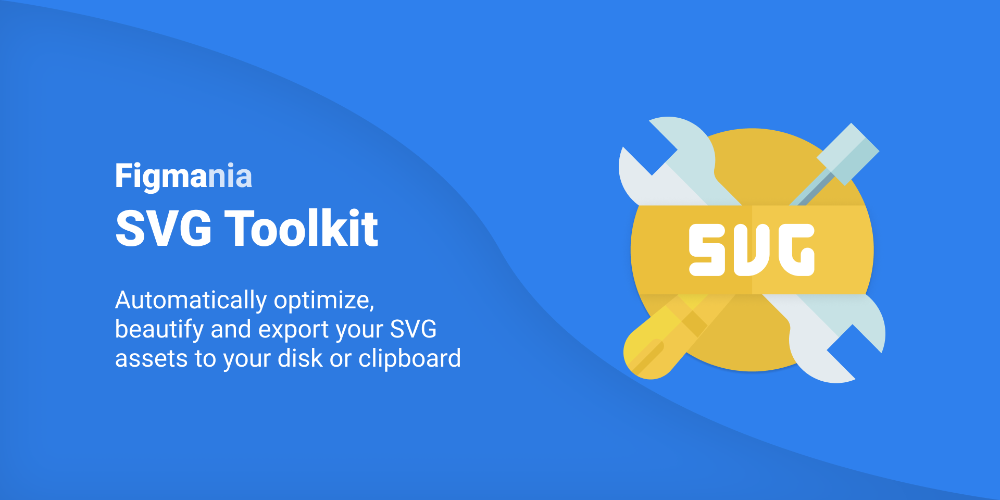

## Figmania SVG Toolkit

> Automatically optimize, beautify and export your SVG assets to your disk or clipboard

## What it is

SVG Toolkit allows you to easily export your work to SVG in perfact formatting, without all the usual rubbish and unneeded clutter.

## Installation

Install directly from the [Figma Plugin Page](https://www.figma.com/community/plugin/980366185319754464/SVG-Animate)

## License

MIT
